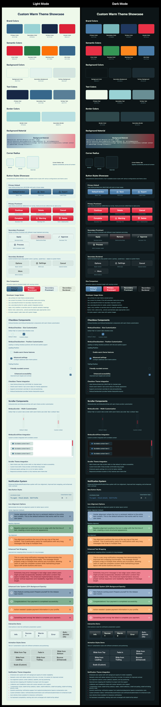

# NimbusUI

[](https://swift.org)
[](https://developer.apple.com/macos/)
[](https://swift.org/package-manager/)
[](LICENSE)

<div align="center">

**A modern SwiftUI component library for macOS applications with a comprehensive theming system and beautiful, interactive components.**

[Features](#-features) • [Installation](#-installation) • [Quick Start](#-quick-start) • [Components](#-components) • [Themes](#-theme-system) • [Documentation](#-documentation)

</div>

---

## 📚 Table of Contents

<details>
<summary><strong>Click to expand</strong></summary>

- [✨ Features](#-features)
- [📦 Installation](#-installation)
- [🚀 Quick Start](#-quick-start)
- [🧱 Components](#-components)
  - [Button Styles](#button-styles)
  - [Checkbox Components](#checkbox-components)
  - [List Components](#list-components)
  - [Scroll Components](#scroll-components)
  - [Onboarding System](#onboarding-system)
- [🎨 Theme System](#-theme-system)
  - [Available Themes](#available-themes)
  - [Theme Complexity Levels](#theme-complexity-levels)
  - [Design Tokens](#design-tokens)
  - [Creating Custom Themes](#creating-custom-themes)
- [🏗️ Architecture](#️-architecture)
- [🎭 Theme Gallery](#-theme-gallery)
- [🛠️ Development](#️-development)
- [📄 License](#-license)
- [🎯 Inspiration & Credits](#-inspiration--credits)
- [🙏 Dependencies](#-dependencies)

</details>

---

## ✨ Features

<table>
<tr>
<td width="50%">

### 🎨 **Advanced Theme System**
- Protocol-based theming with design tokens
- **62% fewer required properties** (17 vs 45+)
- Optional component token system
- Per-component property overrides

### 🧱 **Rich Component Library**
- Professional button hierarchy (4 styles)
- Interactive checkboxes with positioning
- Customizable list items with hover states
- Custom scroll components with theming

</td>
<td width="50%">

### 🌊 **Stunning Visual Effects**
- FluidGradient onboarding backgrounds
- Smooth animations and transitions
- Hover states and micro-interactions
- Material blur effects

### ⚡ **Developer Experience**
- Swift 6.1+ with modern concurrency
- Comprehensive SwiftUI environment integration
- Extensive documentation and examples
- Built for real-world macOS applications

</td>
</tr>
</table>

---

## 📦 Installation

### Swift Package Manager

Add NimbusUI to your project using Swift Package Manager:

```swift
dependencies: [
    .package(url: "https://github.com/yourusername/NimbusUI.git", from: "1.0.0")
]
```

### Requirements

| Requirement | Version |
|-------------|---------|
| **macOS** | 14.0+ |
| **Swift** | 6.1+ |
| **Xcode** | 15.0+ |

---

## 🚀 Quick Start

```swift
import SwiftUI
import NimbusUI

struct ContentView: View {
    var body: some View {
        VStack(spacing: 16) {
            Button("Primary Action") { }
                .buttonStyle(.primaryDefault)
            
            Button("Secondary Action") { }
                .buttonStyle(.secondaryProminent)
        }
        .environment(\.nimbusTheme, NimbusTheme.default)
        .padding()
    }
}
```

---

## 🧱 Components

### Button Styles

NimbusUI provides a comprehensive button hierarchy with built-in theming and state management:

<details>
<summary><strong>Primary Buttons</strong></summary>

For main actions and call-to-action buttons:

```swift
// Default primary button
Button("Save") { }
    .buttonStyle(.primaryDefault)

// Prominent primary button with enhanced styling
Button("Continue") { }
    .buttonStyle(.primaryProminent)
```

</details>

<details>
<summary><strong>Secondary Buttons</strong></summary>

For secondary actions and alternative options:

```swift
// Prominent secondary button
Button("Cancel") { }
    .buttonStyle(.secondaryProminent)

// Bordered secondary button
Button("More Options") { }
    .buttonStyle(.secondaryBordered)
```

</details>

<details>
<summary><strong>Enhanced Button + Label API</strong></summary>

NimbusUI automatically detects Label usage and applies appropriate styling:

```swift
// Plain text button (no changes needed)
Button("Delete") { }
    .buttonStyle(.primaryProminent)

// Label with divider (auto-applied)
Button(action: {}) {
    Label("Export", systemImage: "square.and.arrow.up")
}
.buttonStyle(.primaryProminent)
.environment(\.nimbusButtonHasDivider, true)

// Label with trailing icon
Button(action: {}) {
    Label("Next", systemImage: "arrow.right")
}
.buttonStyle(.primaryProminent)
.environment(\.nimbusButtonIconAlignment, .trailing)
```

</details>

<details>
<summary><strong>Button Customization</strong></summary>

Override specific properties while maintaining theme consistency:

```swift
Button("Custom Button") { }
    .buttonStyle(.primaryDefault)
    .environment(\.nimbusButtonCornerRadii, RectangleCornerRadii(16))
    .environment(\.nimbusMinHeight, 50)
    .environment(\.nimbusButtonMaterial, .thin)
```

</details>

---

### Checkbox Components

Beautiful, themeable checkbox components with full accessibility support and smooth animations.

<details>
<summary><strong>Basic Checkbox</strong></summary>

A standalone checkbox that mimics SwiftUI's Toggle API:

```swift
@State private var isChecked = false

NimbusCheckbox(isOn: $isChecked)
```

</details>

<details>
<summary><strong>Checkbox Item</strong></summary>

A complete checkbox item with title, optional subtitle, and flexible positioning:

```swift
@State private var acceptTerms = false
@State private var receiveUpdates = true

// Basic checkbox item
NimbusCheckboxItem(
    "Accept Terms & Conditions",
    isOn: $acceptTerms
)

// With subtitle
NimbusCheckboxItem(
    "Receive Email Updates",
    subtitle: "Get notified about new features and releases",
    isOn: $receiveUpdates
)

// Trailing checkbox position
NimbusCheckboxItem(
    "Enable Notifications",
    isOn: $receiveUpdates,
    checkboxPosition: .trailing
)
```

</details>

<details>
<summary><strong>Checkbox Features</strong></summary>

- ✅ **Automatic Theming**: Uses theme colors and design tokens
- ✅ **Flexible Positioning**: Checkbox on leading or trailing side
- ✅ **Subtitle Support**: Optional secondary text with proper spacing
- ✅ **Hover States**: Interactive feedback with smooth animations
- ✅ **Accessibility**: Full VoiceOver and keyboard navigation support
- ✅ **Customizable**: Override size, spacing, corner radius via environment
- ✅ **Vertical Alignment**: Center or baseline alignment options

</details>

---

### List Components

Interactive list items with selection states, hover effects, and flexible content:

<details>
<summary><strong>Basic List Item</strong></summary>

```swift
@State private var items = ["Item 1", "Item 2", "Item 3"]
@State private var selection = Set<String>()

ListItem(items: $items, selection: $selection, item: .constant("Item 1")) { binding in
    HStack {
        Image(systemName: "doc.text")
        Text(binding.wrappedValue)
        Spacer()
        Text("Details")
            .foregroundColor(.secondary)
    }
    .padding()
}
```

</details>

<details>
<summary><strong>Interactive Features</strong></summary>

Enable hover effects and customize appearance:

```swift
ListItem(items: $items, selection: $selection, item: $item) { binding in
    Text(binding.wrappedValue)
        .padding()
}
.environment(\.nimbusListItemHighlightOnHover, true)
.environment(\.nimbusListItemHeight, 60)
.environment(\.nimbusListItemCornerRadii, RectangleCornerRadii(12))
```

</details>

---

### Scroll Components

Custom scroll components with beautiful theming and smooth interactions.

<details>
<summary><strong>NimbusScrollView</strong></summary>

A SwiftUI wrapper around NSScrollView with custom themed scrollers:

```swift
NimbusScrollView {
    VStack(spacing: 16) {
        ForEach(1...50, id: \.self) { index in
            Text("Item \(index)")
                .padding()
                .background(Color.gray.opacity(0.1))
                .cornerRadius(8)
        }
    }
    .padding()
}
```

**Scroller Visibility Control:**

```swift
// Hide both scrollers
NimbusScrollView { /* content */ }
.hideScrollers()

// Show only horizontal scroller
NimbusScrollView { /* content */ }
.showsScrollers(vertical: false, horizontal: true)

// Individual control
NimbusScrollView { /* content */ }
.showsVerticalScroller(false)
.showsHorizontalScroller(true)
```

**Custom Styling:**

```swift
NimbusScrollView { /* content */ }
.scrollerWidth(20)           // Thicker scroll track
.knobWidth(8)               // Wider scroll knob
.knobPadding(3)             // More padding around knob
.slotCornerRadius(8)        // Rounded scroll track
```

</details>

<details>
<summary><strong>NimbusScroller</strong></summary>

A standalone SwiftUI wrapper for custom AppKit scrollers:

```swift
@State private var scrollPosition: Float = 0.3
@State private var knobProportion: Float = 0.2

// Vertical scroller
NimbusScroller(
    type: .vertical,
    value: $scrollPosition,
    knobProportion: $knobProportion
)
.frame(width: 50, height: 200)

// Horizontal scroller
NimbusScroller(
    type: .horizontal,
    value: $scrollPosition,
    knobProportion: $knobProportion
)
.frame(width: 300, height: 50)
```

</details>

---

### Onboarding System

Beautiful onboarding flows with FluidGradient animations and smooth page navigation:

<details>
<summary><strong>Basic Setup</strong></summary>

```swift
OnboardingView(features: [
    OnboardingView.Feature(
        title: "Welcome",
        description: "Get started with our amazing app",
        icon: "star.fill"
    ),
    OnboardingView.Feature(
        title: "Powerful Features",
        description: "Discover all the capabilities of our platform",
        icon: "bolt.fill"
    ),
    OnboardingView.Feature(
        title: "Get Started",
        description: "You're ready to begin your journey",
        icon: "checkmark.circle.fill"
    )
])
```

</details>

<details>
<summary><strong>Features</strong></summary>

- 🌊 **FluidGradient Backgrounds**: Smooth, animated gradient backgrounds
- 📏 **Fixed Dimensions**: Consistent 600x560 window size
- 🎯 **Page Navigation**: Built-in page controls and smooth transitions
- 🎨 **Icon Support**: SF Symbols integration for feature icons
- 🎭 **Theme Integration**: Automatically adapts to your chosen theme

</details>

---

## 🎨 Theme System

NimbusUI features a sophisticated theme system that provides both consistency and flexibility.

### Available Themes

<table>
<tr>
<td><strong>Theme</strong></td>
<td><strong>Properties</strong></td>
<td><strong>Best For</strong></td>
</tr>
<tr>
<td><code>MinimalTheme</code></td>
<td>17 required only</td>
<td>Quick start, simple apps</td>
</tr>
<tr>
<td><code>NimbusTheme</code></td>
<td>17 + sensible defaults</td>
<td>Default choice, balanced</td>
</tr>
<tr>
<td><code>MaritimeTheme</code></td>
<td>17 + selective overrides</td>
<td>Professional, structured</td>
</tr>
<tr>
<td><code>CustomWarmTheme</code></td>
<td>17 + extensive overrides</td>
<td>Friendly, accessible</td>
</tr>
</table>

```swift
// Apply any theme
.environment(\.nimbusTheme, MinimalTheme.default)
.environment(\.nimbusTheme, NimbusTheme.default)
.environment(\.nimbusTheme, MaritimeTheme())
.environment(\.nimbusTheme, CustomWarmTheme())
```

### Theme Complexity Levels

<details>
<summary><strong>1. Minimal Theme (Recommended) - 17 Properties Only</strong></summary>

Perfect for getting started or simple customization needs:

```swift
struct MyBrandTheme: NimbusTheming {
    // Only implement colors + 7 core design tokens
    func primaryColor(for scheme: ColorScheme) -> Color { 
        Color(hex: "#007AFF") // Your brand blue
    }
    // ... 16 more required properties
    
    // All component tokens use beautiful defaults automatically!
    // No need to implement 30+ component properties unless you want to customize them
}
```

</details>

<details>
<summary><strong>2. Selective Override Theme - Core + Specific Components</strong></summary>

Start minimal, then override only what you need:

```swift
struct MyCustomTheme: NimbusTheming {
    // ... 17 required core properties
    
    // Override only specific component tokens you want to customize:
    var buttonCornerRadii: RectangleCornerRadii { RectangleCornerRadii(16) } // Rounded buttons
    var scrollerWidth: CGFloat { 12 } // Thinner scrollers
    var checkboxSize: CGFloat { 20 } // Larger checkboxes
    
    // Leave everything else as defaults!
}
```

</details>

<details>
<summary><strong>3. Full Customization Theme - Extensive Component Overrides</strong></summary>

For complete design system control, override many component tokens like `CustomWarmTheme`.

</details>

### Design Tokens

The theme system is organized into **required core tokens** and **optional component tokens**:

<details>
<summary><strong>Core Design Tokens (Required - 17 properties)</strong></summary>

| Category | Count | Properties |
|----------|--------|------------|
| **Brand Colors** | 4 | `primaryColor`, `secondaryColor`, `tertiaryColor`, `accentColor` |
| **Semantic Colors** | 4 | `errorColor`, `successColor`, `warningColor`, `infoColor` |
| **Background Colors** | 3 | `backgroundColor`, `secondaryBackgroundColor`, `tertiaryBackgroundColor` |
| **Text Colors** | 3 | `primaryTextColor`, `secondaryTextColor`, `tertiaryTextColor` |
| **Border Colors** | 2 | `borderColor`, `secondaryBorderColor` |
| **Core Design** | 1 | `backgroundMaterial`, `cornerRadii`, `animation`, `animationFast`, `minHeight`, `horizontalPadding`, `elevation` |

</details>

<details>
<summary><strong>Component Design Tokens (Optional - 30+ properties with defaults)</strong></summary>

| Component | Tokens |
|-----------|---------|
| **Button** | `buttonCornerRadii`, `compactButtonCornerRadii`, `labelContentSpacing` |
| **List** | `listItemCornerRadii`, `listItemHeight` |
| **Checkbox** | `checkboxSize`, `checkboxCornerRadii`, `checkboxBorderWidth`, `checkboxItemSpacing`, etc. |
| **Scroller** | `scrollerWidth`, `scrollerKnobWidth`, `scrollerKnobPadding`, `scrollerSlotCornerRadius`, etc. |

</details>

### Key Benefits

> ✅ **62% fewer required properties** (17 vs 45+ previously)  
> ✅ **Selective customization** - override only what you need  
> ✅ **Future-proof** - new components add defaults, existing themes unaffected  
> ✅ **Beautiful defaults** - protocol extensions provide sensible values

### Creating Custom Themes

<details>
<summary><strong>Implementation Example</strong></summary>

```swift
struct MyCustomTheme: NimbusTheming {
    // Implement required color methods
    func primaryColor(for scheme: ColorScheme) -> Color { 
        Color.adaptiveColor(
            light: Color(hex: "#007AFF"),
            dark: Color(hex: "#0A84FF"),
            scheme: scheme
        )
    }
    
    func backgroundColor(for scheme: ColorScheme) -> Color { 
        Color.adaptiveColor(
            light: .white,
            dark: .black,
            scheme: scheme
        )
    }
    
    // ... other required color methods
    
    // Design token properties
    let cornerRadii = RectangleCornerRadii(8)
    let minHeight: CGFloat = 32
    let horizontalPadding: CGFloat = 12
    // ... other design tokens
    
    // Optional: Override specific component tokens
    var checkboxSize: CGFloat { 18 }
    var scrollerWidth: CGFloat { 14 }
}
```

</details>

---

## 🏗️ Architecture

<details>
<summary><strong>Core Systems</strong></summary>

| System | Description |
|--------|-------------|
| **Theme System** | Protocol-based theming with environment injection |
| **Component Library** | Reusable, themeable UI components |
| **Modifier System** | Custom view modifiers for consistent styling |
| **Environment Configuration** | SwiftUI environment values for customization |

</details>

<details>
<summary><strong>Custom View Modifiers</strong></summary>

#### Styling Modifiers
- **`NimbusFilledModifier`**: Fill backgrounds with interaction states (hover, pressed)
- **`NimbusShadowModifier`**: Elevation-based shadows using theme elevation tokens
- **`NimbusInnerShadowModifier`**: Inner shadow effects for depth and dimension
- **`NimbusGradientBorderModifier`**: Gradient borders for enhanced visual appeal
- **`NimbusBorderedModifier`**: Standard borders using theme border colors

#### Interaction Modifiers  
- **`NimbusHoverableModifier`**: Hover interactions with smooth state transitions
- **`LevitatingViewModifier`**: Floating effects for elevated components

#### Layout Modifiers
- **`NimbusAspectRatioModifier`**: Consistent aspect ratio handling
- **`NimbusDividerLabelStyle`**: Enhanced label styling with optional dividers for buttons

</details>

<details>
<summary><strong>Component Organization</strong></summary>

```
Sources/NimbusUI/Components/
├── ButtonStyles/           # Button style implementations
│   ├── Appearance.swift
│   ├── PrimaryDefaultButtonStyle.swift
│   ├── PrimaryProminentButtonStyle.swift
│   ├── SecondaryBorderedButtonStyle.swift
│   ├── SecondaryProminentButtonStyle.swift
│   └── Preview/           # Dedicated preview files
├── Checkbox/              # Checkbox components
│   ├── NimbusCheckbox.swift
│   ├── NimbusCheckboxItem.swift
│   └── Preview/
├── List/                  # List components
│   ├── ListItem.swift
│   └── Preview/
├── Onboarding/            # Onboarding system
│   ├── FeaturePageView.swift
│   ├── OnboardingView.swift
│   ├── PageControlView.swift
│   └── Preview/
├── ScrollView/            # Custom scroll view
│   ├── NimbusScrollView.swift
│   └── Preview/
└── Scroller/              # Custom scroller component
    ├── NimbusScroller.swift
    └── Preview/
```

**Folder Structure Guidelines:**
1. **Component Folder**: Named after the component
2. **Implementation Files**: Main component files in folder root
3. **Preview Folder**: Dedicated `Preview/` subfolder
4. **Preview Files**: Pattern `ComponentName+Preview.swift`

</details>

<details>
<summary><strong>Design Principles</strong></summary>

1. **🎯 Consistency First** - Every component feels part of a cohesive system
2. **🔧 Flexibility** - Override any property when needed
3. **⚡ Performance** - Optimized for real-world usage
4. **♿ Accessibility** - Built-in macOS accessibility support
5. **👨‍💻 Developer Experience** - Intuitive APIs and clear documentation

</details>

---

## 🎭 Theme Gallery

<table>
<tr>
<th>Nimbus Theme (Default)</th>
<th>Maritime Theme</th>
<th>Warm Theme</th>
</tr>
<tr>
<td></td>
<td></td>
<td></td>
</tr>
<tr>
<td><em>Clean, balanced design</em></td>
<td><em>Professional, structured</em></td>
<td><em>Friendly, accessible</em></td>
</tr>
</table>

---

## 🛠️ Development

<details>
<summary><strong>Building</strong></summary>

```bash
# Build the package
swift build

# Run tests
swift test

# Clean build artifacts
swift package clean

# Resolve dependencies
swift package resolve
```

</details>

<details>
<summary><strong>Testing</strong></summary>

NimbusUI uses Swift Testing framework with snapshot testing for visual regression testing.

```bash
# Run all tests
swift test

# Update snapshots (if needed)
swift test -Xswiftc -DUPDATE_SNAPSHOTS
```

</details>

<details>
<summary><strong>Contributing</strong></summary>

1. Fork the repository
2. Create your feature branch (`git checkout -b feature/amazing-feature`)
3. Commit your changes (`git commit -m 'Add amazing feature'`)
4. Push to the branch (`git push origin feature/amazing-feature`)
5. Open a Pull Request

</details>

---

## 📄 License

NimbusUI is available under the MIT license. See the [LICENSE](LICENSE) file for more info.

---

## 🎯 Inspiration & Credits

<div align="center">

**NimbusUI is heavily inspired by the excellent [Luminare](https://github.com/MrKai77/Luminare) macOS design system.**

*All design philosophy, component architecture, and theming concepts are credited to the original Luminare project.*

</div>

[**Luminare**](https://github.com/MrKai77/Luminare) is "The modern, translucent design system made with SwiftUI" created by [MrKai77](https://github.com/MrKai77). Luminare pioneered many of the design patterns and architectural decisions that make NimbusUI possible:


### 🙏 Acknowledgments

We extend our deepest gratitude to:

- **[MrKai77](https://github.com/MrKai77)** and the Luminare team for creating the foundational design system
- **The Luminare community** for demonstrating best practices in SwiftUI component design
- **Loop and other projects** that showcase how beautiful macOS apps can be built with thoughtful design systems

> **Note**: NimbusUI builds upon Luminare's concepts while adding our own innovations like the optional component token system, enhanced button hierarchy, and specialized components for specific use cases.

**🔗 Explore the original: [Luminare on GitHub](https://github.com/MrKai77/Luminare)**

---

## 🙏 Dependencies

<table>
<tr>
<td><strong>Library</strong></td>
<td><strong>Purpose</strong></td>
<td><strong>License</strong></td>
</tr>
<tr>
<td><a href="https://github.com/Cindori/FluidGradient">FluidGradient</a></td>
<td>Beautiful gradient animations</td>
<td>MIT</td>
</tr>
<tr>
<td><a href="https://github.com/pointfreeco/swift-snapshot-testing">swift-snapshot-testing</a></td>
<td>Visual regression testing</td>
<td>MIT</td>
</tr>
</table>

---

<div align="center">

**Made with ❤️ for the macOS developer community**

[⭐ Star us on GitHub](https://github.com/yourusername/NimbusUI) • [🐛 Report Issues](https://github.com/yourusername/NimbusUI/issues) • [💬 Discussions](https://github.com/yourusername/NimbusUI/discussions)

</div>