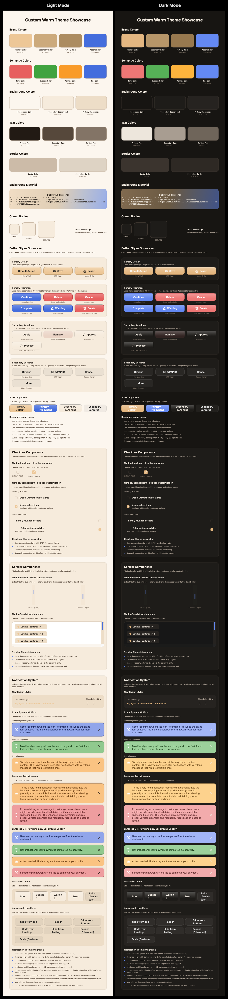

# NimbusUI

[](https://swift.org)
[](https://developer.apple.com/macos/)
[](https://swift.org/package-manager/)

A modern SwiftUI component library for macOS applications with a comprehensive theming system and beautiful, interactive components.

## ✨ Features

- 🎨 **Advanced Theme System** - Protocol-based theming with design tokens and per-component overrides
- 🧱 **Rich Component Library** - Buttons, lists, onboarding flows, and custom modifiers
- 🌊 **Stunning Animations** - FluidGradient backgrounds and smooth transitions
- 🔧 **Highly Customizable** - Override any design property while maintaining consistency
- ⚡ **Performance Optimized** - Built for real-world macOS applications

## 📦 Installation

Add NimbusUI to your project using Swift Package Manager:

```swift
dependencies: [
    .package(url: "https://github.com/yourusername/NimbusUI.git", from: "1.0.0")
]
```

**Requirements:**
- macOS 14.0+
- Swift 6.1+
- Xcode 15.0+

## 🚀 Quick Start

```swift
import SwiftUI
import NimbusUI

struct ContentView: View {
    var body: some View {
        VStack(spacing: 16) {
            Button("Primary Action") { }
                .buttonStyle(.primaryDefault)
            
            Button("Secondary Action") { }
                .buttonStyle(.secondaryProminent)
        }
        .environment(\.nimbusTheme, NimbusTheme.default)
        .padding()
    }
}
```

## 🧱 Components

### Button Styles

NimbusUI provides a comprehensive button hierarchy:

```swift
// Primary buttons
Button("Save") { }.buttonStyle(.primaryDefault)
Button("Continue") { }.buttonStyle(.primaryProminent)

// Secondary buttons  
Button("Cancel") { }.buttonStyle(.secondaryProminent)
Button("More") { }.buttonStyle(.secondaryBordered)
```

### List Components

Interactive list items with selection and hover states:

```swift
@State private var items = ["Item 1", "Item 2", "Item 3"]
@State private var selection = Set<String>()

ListItem(items: $items, selection: $selection, item: .constant("Item 1")) { binding in
    Text(binding.wrappedValue)
        .padding()
}
.environment(\.nimbusListItemHighlightOnHover, true)
```

### Onboarding System

Beautiful onboarding flows with FluidGradient animations:

```swift
OnboardingView(features: [
    OnboardingView.Feature(
        title: "Welcome",
        description: "Get started with our amazing app",
        icon: "star.fill"
    )
])
```

## 🎨 Theme System

NimbusUI features a sophisticated theme system that provides both consistency and flexibility.

### Available Themes

```swift
// Default theme
.environment(\.nimbusTheme, NimbusTheme.default)

// Professional maritime theme
.environment(\.nimbusTheme, MaritimeTheme())

// Warm, friendly theme
.environment(\.nimbusTheme, CustomWarmTheme())
```

### Design Tokens

Themes provide consistent defaults for all design properties:

- **Layout**: `minHeight`, `horizontalPadding`, `listItemHeight`
- **Animations**: `animation`, `animationFast`
- **Corner Radii**: `cornerRadii`, `buttonCornerRadii`, `compactButtonCornerRadii`, `listItemCornerRadii`
- **Elevation**: `elevation`
- **Spacing**: `labelContentSpacing`

### Property Overrides

Override specific properties while keeping theme consistency:

```swift
Button("Custom Button") { }
    .buttonStyle(.primaryDefault)
    .environment(\.nimbusTheme, MaritimeTheme())
    .environment(\.nimbusButtonCornerRadii, RectangleCornerRadii(16))
    .environment(\.nimbusMinHeight, 50)
```

### Creating Custom Themes

Implement the `NimbusTheming` protocol for complete customization:

```swift
struct MyCustomTheme: NimbusTheming {
    // Implement required color methods
    func primaryColor(for scheme: ColorScheme) -> Color { ... }
    func backgroundColor(for scheme: ColorScheme) -> Color { ... }
    // ... other color methods
    
    // Design token properties
    let cornerRadii = RectangleCornerRadii(8)
    let minHeight: CGFloat = 32
    let horizontalPadding: CGFloat = 12
    // ... other design tokens
}
```

## 🏗️ Architecture

NimbusUI is built around several core systems:

- **Theme System**: Protocol-based theming with environment injection
- **Component Library**: Reusable, themeable UI components
- **Modifier System**: Custom view modifiers for consistent styling
- **Environment Configuration**: SwiftUI environment values for customization

### Design Principles

1. **Consistency First** - Every component feels part of a cohesive system
2. **Flexibility** - Override any property when needed
3. **Performance** - Optimized for real-world usage
4. **Accessibility** - Built-in macOS accessibility support
5. **Developer Experience** - Intuitive APIs and clear documentation

## Preview


## 🛠️ Development

### Building

```bash
# Build the package
swift build

# Run tests
swift test

# Clean build artifacts
swift package clean
```

### Testing

NimbusUI uses Swift Testing framework with snapshot testing for visual regression testing.

```bash
# Run all tests
swift test

# Update snapshots (if needed)
swift test -Xswiftc -DUPDATE_SNAPSHOTS
```

## 📄 License

NimbusUI is available under the MIT license. See the LICENSE file for more info.

## 🙏 Dependencies

- [FluidGradient](https://github.com/Cindori/FluidGradient) - Beautiful gradient animations
- [swift-snapshot-testing](https://github.com/pointfreeco/swift-snapshot-testing) - Visual regression testing

---

Made with ❤️ for the macOS developer community.