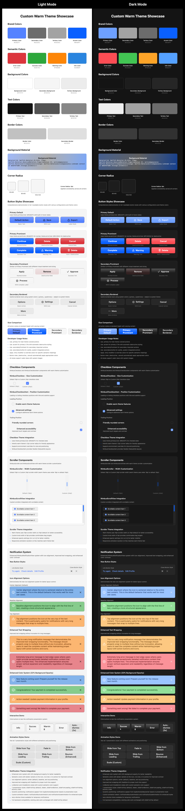

# NimbusUI

[](https://swift.org)
[](https://developer.apple.com/macos/)
[](https://swift.org/package-manager/)
[](LICENSE)

<div align="center">

**A modern SwiftUI component library for macOS applications with a comprehensive theming system and beautiful, interactive components.**

[Features](#-features) • [Installation](#-installation) • [Quick Start](#-quick-start) • [Components](#-components) • [Themes](#-theme-system) • [Documentation](#-documentation)

</div>

---

## 📚 Table of Contents

<details>
<summary><strong>Click to expand</strong></summary>

- [✨ Features](#-features)
- [📦 Installation](#-installation)
- [🚀 Quick Start](#-quick-start)
- [🧱 Components](#-components)
  - [Button Styles](#button-styles)
  - [Checkbox Components](#checkbox-components)
  - [Badge Components](#badge-components)
  - [List Components](#list-components)
  - [Scroll Components](#scroll-components)
  - [Notification System](#notification-system)
  - [Onboarding System](#onboarding-system)
- [🎨 Theme System](#-theme-system)
  - [Available Themes](#available-themes)
  - [Theme Complexity Levels](#theme-complexity-levels)
  - [Design Tokens](#design-tokens)
  - [Creating Custom Themes](#creating-custom-themes)
- [🏗️ Architecture](#️-architecture)
- [🎭 Theme Gallery](#-theme-gallery)
- [🛠️ Development](#️-development)
- [📄 License](#-license)
- [🎯 Inspiration & Credits](#-inspiration--credits)
- [🙏 Dependencies](#-dependencies)

</details>

---

## ✨ Features

<table>
<tr>
<td width="50%">

### 🎨 **Advanced Theme System**
- Protocol-based theming with design tokens
- **62% fewer required properties** (17 vs 45+)
- Optional component token system
- Per-component property overrides

### 🧱 **Rich Component Library**
- Comprehensive button hierarchy (7 styles)
- Interactive checkboxes with positioning
- Semantic badge components with flexible shapes
- Customizable list items with hover states
- Custom scroll components with theming
- Notification system with semantic types

</td>
<td width="50%">

### 🌊 **Stunning Visual Effects**
- FluidGradient onboarding backgrounds
- Smooth animations and transitions
- Hover states and micro-interactions
- Material blur effects

### ⚡ **Developer Experience**
- Swift 5.9+ with modern concurrency
- Modular library architecture for selective imports
- Comprehensive SwiftUI environment integration
- Extensive documentation and examples
- Built for real-world macOS applications

</td>
</tr>
</table>

---

## 📦 Installation

### Swift Package Manager

Add NimbusUI to your project using Swift Package Manager. In Xcode, select `File > Add Packages...` and enter the repository URL:

```
https://github.com/iSapozhnik/NimbusUI.git
```

### Package Dependencies

Add the desired libraries to your target's dependencies. You can choose to include all libraries via the umbrella `NimbusUI` product, or select only the specific libraries you need.

```swift
// In your Package.swift
dependencies: [
    .package(url: "https://github.com/iSapozhnik/NimbusUI.git", from: "1.0.0")
],
targets: [
    .target(
        name: "YourApp",
        dependencies: [
            // Option 1: Add all libraries
            "NimbusUI",
            
            // Option 2: Add only the libraries you need
            .product(name: "NimbusCore", package: "NimbusUI"),
            .product(name: "NimbusComponents", package: "NimbusUI"),
            .product(name: "NimbusNotifications", package: "NimbusUI"),
            .product(name: "NimbusOnboarding", package: "NimbusUI")
        ]
    )
]
```

### Importing Libraries

Once added, import the modules in your Swift files:

```swift
import NimbusCore         // Core theming, modifiers, and utilities
import NimbusComponents   // Buttons, checkboxes, lists, etc.
import NimbusNotifications// Notification system
import NimbusOnboarding   // Onboarding flow
import NimbusUI           // Includes all of the above
```

### Requirements

| Requirement | Version |
|-------------|---------|
| **macOS** | 14.0+ |
| **Swift** | 5.9+ |
| **Xcode** | 15.0+ |
| **Architecture** | Modular libraries (selective imports supported) |

---

## 🚀 Quick Start

Apply a theme to any view hierarchy using the `.theme()` modifier. NimbusUI components will automatically adapt their appearance based on the theme.

```swift
import SwiftUI
import NimbusCore        // For theming system
import NimbusComponents  // For button styles
// Or simply: import NimbusUI  // For all features

struct ContentView: View {
    var body: some View {
        VStack(spacing: 16) {
            Button("Primary Action") { }
                .buttonStyle(.primary)
            
            Button("Accent Action") { }
                .buttonStyle(.accent)
        }
        .theme(NimbusTheme.default)
        .padding()
    }
}
```

---

## 🧱 Components

### Button Styles

NimbusUI provides a comprehensive button hierarchy with 7 distinct styles, built-in theming and state management. All styles integrate with the `controlSize` environment value for adaptive sizing.

<details>
<summary><strong>Primary & Accent Buttons</strong></summary>

For the most important actions in your UI.

```swift
// Main action button, filled with the theme's primary color.
Button("Save Changes") { }
    .buttonStyle(.primary)

// Prominent action button, filled with the theme's accent color.
// Ideal for call-to-actions like "Continue" or "Sign Up".
Button("Continue") { }
    .buttonStyle(.accent)

// The .accent style also respects the button's role for semantics.
Button("Delete", role: .destructive) { }
    .buttonStyle(.accent) // Will use the theme's errorColor
```

</details>

<details>
<summary><strong>Secondary & Outline Buttons</strong></summary>

For less prominent actions or alternative options.

```swift
// A subtle, filled button for secondary actions.
Button("Cancel") { }
    .buttonStyle(.secondary)

// An outlined button with a border matching the primary style.
Button("Learn More") { }
    .buttonStyle(.primaryOutline)

// A subtle, outlined button for tertiary actions.
Button("More Options") { }
    .buttonStyle(.secondaryOutline)
```

</details>

<details>
<summary><strong>Button Customization with Convenience Methods</strong></summary>

NimbusUI provides SwiftUI-idiomatic convenience methods for button customization:

```swift
// Basic button with custom styling
Button("Save Changes") { }
    .buttonStyle(.primary)
    .cornerRadii(RectangleCornerRadii(12))
    .elevation(.medium)
    .controlSize(.large)

// Label button with divider and icon alignment
Button(action: {}) {
    Label("Export", systemImage: "square.and.arrow.up")
}
.buttonStyle(.accent)
.hasDivider(true)
.iconAlignment(.leading)
.controlSize(.regular)

// Advanced customization with multiple modifiers
Button(action: {}) {
    Label("Delete", systemImage: "trash")
}
.buttonStyle(.accent)
.cornerRadii(RectangleCornerRadii(8))
.elevation(.high)
.labelConfiguration(hasDivider: true, iconAlignment: .trailing, contentPadding: 8)

// Icon-only square button
Button(action: {}) {
    Image(systemName: "gear")
}
.buttonStyle(.secondary)
.iconOnly()
.controlSize(.regular)

// Wide banner button
Button("Get Started Now") { }
    .buttonStyle(.accent)
    .banner(aspectRatio: 3.0)
    .controlSize(.large)
```

**Available Convenience Methods:**
- `.cornerRadii(RectangleCornerRadii)` - Custom corner radii
- `.elevation(Elevation)` - Shadow depth (.low, .medium, .high)
- `.hasDivider(Bool)` - Divider between icon and text
- `.iconAlignment(HorizontalAlignment)` - Icon position (.leading/.trailing)
- `.contentPadding(CGFloat)` - Spacing between icon and text
- `.labelConfiguration(hasDivider:iconAlignment:contentPadding:)` - Combined label settings
- `.iconOnly(size:)` - Square aspect ratio for icons
- `.banner(aspectRatio:)` - Wide buttons for call-to-actions

**Migration from Legacy Environment Values:**
```swift
// Old approach (still works)
Button("Save") { }
    .buttonStyle(.primary)
    .environment(\.nimbusButtonCornerRadii, RectangleCornerRadii(12))
    .environment(\.nimbusElevation, .medium)

// New convenience method approach (recommended)
Button("Save") { }
    .buttonStyle(.primary)
    .cornerRadii(RectangleCornerRadii(12))
    .elevation(.medium)
```

</details>

<details>
<summary><strong>ControlSize Support</strong></summary>

All button styles support SwiftUI's native controlSize for consistent sizing:

```swift
// Different sizes for the same style
VStack(spacing: 12) {
    Button("Large") { }.buttonStyle(.primary).controlSize(.large)      // 52px height
    Button("Regular") { }.buttonStyle(.primary).controlSize(.regular)  // 44px height
    Button("Small") { }.buttonStyle(.primary).controlSize(.small)      // 36px height
    Button("Mini") { }.buttonStyle(.primary).controlSize(.mini)        // 28px height
}

// Size affects padding, font size, and overall proportions
Button("Adaptive Button") { }
    .buttonStyle(.accent)
    .controlSize(.large)  // Larger text, more padding
```

**Supported Sizes:**
- `.large` - 52px height, enhanced padding and font size
- `.regular` - 44px height, standard appearance (default)
- `.small` - 36px height, compact padding and font size
- `.mini` - 28px height, minimal padding and font size

**Button Hierarchy:**
- `.primary` - Main actions, filled with primaryColor
- `.accent` - Prominent actions, filled with accentColor, supports button roles
- `.secondary` - Secondary actions, subtle filled styling
- `.primaryOutline` - Primary actions, outlined with primaryColor border
- `.secondaryOutline` - Secondary actions, outlined with subtle border
- `.link` - Text-only action buttons for minimal interactions
- `.close` - Icon-only dismiss buttons for overlays and modals

</details>

<details>
<summary><strong>Link & Close Button Styles</strong></summary>

For specialized interaction patterns and minimal UI elements.

```swift
// Link buttons for text-only actions without backgrounds
Button("Learn More") { }
    .buttonStyle(.link)

Button("View Documentation") { }
    .buttonStyle(.link)
    .controlSize(.small)

// Close buttons for dismissing overlays, modals, or panels  
Button(action: { dismiss() }) {
    Image(systemName: "xmark")
}
.buttonStyle(.close)

// Close button with custom sizing
Button(action: { closePanel() }) {
    Image(systemName: "xmark.circle.fill")  
}
.buttonStyle(.close)
.controlSize(.large)
```

**Use Cases:**
- **Link Style**: Navigation links, secondary actions, help text links
- **Close Style**: Modal dismissal, panel close buttons, overlay removal

</details>

<details>
<summary><strong>Aspect Ratio Configuration</strong></summary>

Optional aspect ratio constraints for specialized button layouts:

```swift
// Square icon button (1:1 aspect ratio)
Button { } label: { Image(systemName: "gear") }
    .buttonStyle(.primary)
    .controlSize(.regular)
    .nimbusAspectRatio(1.0)
    .nimbusAspectRatioContentMode(.fit)

// Wide banner button (3:1 aspect ratio)
Button("Get Started Now") { }
    .buttonStyle(.accent)
    .controlSize(.large)
    .nimbusAspectRatio(3.0)
    .nimbusAspectRatioHasFixedHeight(true)

// Proportional responsive button (2.5:1 ratio)
Button("Continue") { }
    .buttonStyle(.primary)
    .controlSize(.regular)
    .nimbusAspectRatio(2.5)
    .nimbusAspectRatioContentMode(.fit)
    .nimbusAspectRatioHasFixedHeight(false)
```

**Aspect Ratio Environment Values:**
- `nimbusAspectRatio(CGFloat?)` - Target aspect ratio (width/height)
- `nimbusAspectRatioContentMode(ContentMode?)` - How content should fit (`.fit` by default)
- `nimbusAspectRatioHasFixedHeight(Bool)` - Whether height should be fixed (`true` by default)

**Use Cases:**
- Square buttons for toolbar icons or action buttons
- Wide buttons with fixed proportions for banners
- Responsive buttons that maintain proportions across screen sizes
- Icon-only buttons requiring consistent geometry

</details>

---

### Checkbox Components

Beautiful, themeable checkbox components with full accessibility support and smooth animations.

<details>
<summary><strong>Basic Checkbox</strong></summary>

A standalone checkbox that mimics SwiftUI's Toggle API:

```swift
@State private var isChecked = false

NimbusCheckbox(isOn: $isChecked)
```

</details>

<details>
<summary><strong>Checkbox Item</strong></summary>

A complete checkbox item with title, optional subtitle, and flexible positioning:

```swift
@State private var acceptTerms = false
@State private var receiveUpdates = true

// Basic checkbox item
NimbusCheckboxItem(
    "Accept Terms & Conditions",
    isOn: $acceptTerms
)

// With subtitle
NimbusCheckboxItem(
    "Receive Email Updates",
    subtitle: "Get notified about new features and releases",
    isOn: $receiveUpdates
)

// Trailing checkbox position
NimbusCheckboxItem(
    "Enable Notifications",
    isOn: $receiveUpdates,
    checkboxPosition: .trailing
)
```

</details>

<details>
<summary><strong>Checkbox Customization</strong></summary>

Use convenience methods for easy customization without environment variables:

```swift
@State private var isChecked = false

// Basic checkbox with custom styling
NimbusCheckbox(isOn: $isChecked)
    .size(20)
    .strokeWidth(2.5)
    .cornerRadii(RectangleCornerRadii(6))

// Checkbox item with custom appearance
NimbusCheckboxItem("Enable notifications", isOn: $isChecked)
    .size(18)
    .lineCap(.round)
    .itemSpacing(12)
    .verticalAlignment(.top)
```

**Available Convenience Methods:**
- `.size(CGFloat)` - Checkbox dimensions
- `.strokeWidth(CGFloat)` - Border thickness
- `.cornerRadii(RectangleCornerRadii)` - Corner styling
- `.lineCap(CGLineCap)` - Check mark line endings
- `.itemSpacing(CGFloat)` - Space between checkbox and text
- `.verticalAlignment(VerticalAlignment)` - Text alignment relative to checkbox

</details>

<details>
<summary><strong>Checkbox Features</strong></summary>

- ✅ **Automatic Theming**: Uses theme colors and design tokens
- ✅ **Flexible Positioning**: Checkbox on leading or trailing side
- ✅ **Subtitle Support**: Optional secondary text with proper spacing
- ✅ **Hover States**: Interactive feedback with smooth animations
- ✅ **Accessibility**: Full VoiceOver and keyboard navigation support
- ✅ **Customizable**: Override size, spacing, corner radius via convenience modifiers
- ✅ **Vertical Alignment**: Center or baseline alignment options

</details>

---

### Badge Components

Semantic badge components with content-adaptive sizing, flexible shapes, and semantic color coding for status indicators, labels, and notifications.

<details>
<summary><strong>Basic Badge Usage</strong></summary>

Create badges with semantic types and automatic theming:

```swift
import NimbusComponents

// Primary badges with solid backgrounds
PrimaryBadge("New", semanticType: .info)
PrimaryBadge("Success", semanticType: .success)
PrimaryBadge("Warning", semanticType: .warning)
PrimaryBadge("Error", semanticType: .error)

// Secondary badges with transparent backgrounds and borders
SecondaryBadge("Draft", semanticType: .info)
SecondaryBadge("Published", semanticType: .success)
SecondaryBadge("Review", semanticType: .warning)
SecondaryBadge("Failed", semanticType: .error)
```

</details>

<details>
<summary><strong>Badge with Icons</strong></summary>

Enhanced badges with SF Symbols for better visual communication:

```swift
// Primary badge with icon
PrimaryBadge("New Feature", systemImage: "star.fill", semanticType: .info)
PrimaryBadge("Completed", systemImage: "checkmark.circle.fill", semanticType: .success)
PrimaryBadge("Attention", systemImage: "exclamationmark.triangle.fill", semanticType: .warning)
PrimaryBadge("Failed", systemImage: "xmark.circle.fill", semanticType: .error)

// Secondary badge with icon
SecondaryBadge("3 items", systemImage: "doc.text", semanticType: .info)
SecondaryBadge("Synced", systemImage: "cloud.fill", semanticType: .success)
```

</details>

<details>
<summary><strong>Badge Shapes & Customization</strong></summary>

Flexible badge shapes and content-adaptive sizing with convenience methods:

```swift
// Capsule badges (default)
PrimaryBadge("Capsule Shape", semanticType: .info)
    .capsule()

// Rounded rectangle badges with custom corner radius
SecondaryBadge("Rounded 4px", semanticType: .success)
    .roundedRect(4)

SecondaryBadge("Rounded 12px", semanticType: .warning)
    .roundedRect(12)

// Custom border width (secondary badges only)
SecondaryBadge("Thick Border", semanticType: .info)
    .borderWidth(2.5)

// Custom padding with EdgeInsets for maximum flexibility
PrimaryBadge("Custom Padding", semanticType: .success)
    .contentPadding(EdgeInsets(top: 6, leading: 12, bottom: 6, trailing: 12))

// Uniform padding shorthand
SecondaryBadge("Equal Padding", semanticType: .warning)
    .contentPadding(10)
```

</details>

<details>
<summary><strong>ControlSize Support</strong></summary>

Badges automatically adapt to controlSize for consistent typography and spacing:

```swift
// Different sizes with adaptive font and padding scaling
VStack(spacing: 8) {
    PrimaryBadge("Large", semanticType: .info)
        .controlSize(.large)     // 18pt font, enhanced padding
    
    PrimaryBadge("Regular", semanticType: .success)
        .controlSize(.regular)   // 14pt font, standard padding (default)
    
    PrimaryBadge("Small", semanticType: .warning)
        .controlSize(.small)     // 12pt font, compact padding
    
    PrimaryBadge("Mini", semanticType: .error)
        .controlSize(.mini)      // 10pt font, minimal padding
}

// Works with all badge types and shapes
SecondaryBadge("Responsive", semanticType: .info)
    .roundedRect(8)
    .controlSize(.large)
    .borderWidth(1.5)
```

</details>

<details>
<summary><strong>Content-Adaptive Sizing</strong></summary>

Badges automatically size based on their content without fixed dimensions:

```swift
// Short text adapts naturally
PrimaryBadge("New", semanticType: .info)

// Long text wraps appropriately
PrimaryBadge("This is a very long badge text that demonstrates content adaptation", semanticType: .success)
    .capsule()

// Mixed content lengths in the same layout
HStack(spacing: 8) {
    SecondaryBadge("Short", semanticType: .info)
    SecondaryBadge("Medium Length", semanticType: .success)
    SecondaryBadge("This is a much longer badge text", semanticType: .warning)
}
```

</details>

<details>
<summary><strong>Badge Features</strong></summary>

- 🎨 **Semantic Types**: Info, Success, Warning, Error with automatic theme colors
- 🔄 **Two Styles**: PrimaryBadge (solid) and SecondaryBadge (outlined) 
- 📐 **Flexible Shapes**: Capsule and rounded rectangle with custom radius
- 📏 **Content-Adaptive**: Automatically sizes based on content and padding
- 🎛️ **ControlSize Support**: Responsive typography and spacing across all sizes
- 🔧 **EdgeInsets Padding**: Asymmetric padding control for precise layouts
- 🎭 **Theme Integration**: Automatic semantic colors with light/dark mode support
- 🔗 **Icon Support**: SF Symbols integration for enhanced visual communication
- ✨ **Convenience Methods**: SwiftUI-idiomatic customization API

</details>

---

### List Components

Interactive list items with selection states, hover effects, and flexible content:

<details>
<summary><strong>Basic List Item</strong></summary>

```swift
@State private var items = ["Item 1", "Item 2", "Item 3"]
@State private var selection = Set<String>()

ListItem(items: $items, selection: $selection, item: .constant("Item 1")) { binding in
    HStack {
        Image(systemName: "doc.text")
        Text(binding.wrappedValue)
        Spacer()
        Text("Details")
            .foregroundColor(.secondary)
    }
    .padding()
}
```

</details>

<details>
<summary><strong>Interactive Features</strong></summary>

Enable hover effects and customize appearance with convenience modifiers:

```swift
ListItem(items: $items, selection: $selection, item: $item) { binding in
    Text(binding.wrappedValue)
        .padding()
}
.nimbusListItemHighlightOnHover(true)
.nimbusListItemHeight(60)
.nimbusListItemCornerRadii(RectangleCornerRadii(12))
```

</details>

---

### Scroll Components

Custom scroll components with beautiful theming and smooth interactions.

<details>
<summary><strong>NimbusScrollView</strong></summary>

A SwiftUI wrapper around NSScrollView with custom themed scrollers:

```swift
NimbusScrollView {
    VStack(spacing: 16) {
        ForEach(1...50, id: \.self) { index in
            Text("Item \(index)")
                .padding()
                .background(Color.gray.opacity(0.1))
                .cornerRadius(8)
        }
    }
    .padding()
}
```

**Scroller Visibility Control:**

```swift
// Hide both scrollers
NimbusScrollView { /* content */ }
.hideScrollers()

// Show only horizontal scroller
NimbusScrollView { /* content */ }
.showsScrollers(vertical: false, horizontal: true)

// Individual control
NimbusScrollView { /* content */ }
.showsVerticalScroller(false)
.showsHorizontalScroller(true)
```

**Custom Styling:**

```swift
NimbusScrollView { /* content */ }
.scrollerWidth(20)           // Thicker scroll track
.knobWidth(8)               // Wider scroll knob
.knobPadding(3)             // More padding around knob
.slotCornerRadius(8)        // Rounded scroll track
```

</details>

<details>
<summary><strong>NimbusScroller</strong></summary>

A standalone SwiftUI wrapper for custom AppKit scrollers:

```swift
@State private var scrollPosition: Float = 0.3
@State private var knobProportion: Float = 0.2

// Vertical scroller
NimbusScroller(
    type: .vertical,
    value: $scrollPosition,
    knobProportion: $knobProportion
)
.frame(width: 50, height: 200)

// Horizontal scroller
NimbusScroller(
    type: .horizontal,
    value: $scrollPosition,
    knobProportion: $knobProportion
)
.frame(width: 300, height: 50)
```

</details>

---

### Notification System

Professional notification system with semantic styling, auto-dismiss timing, and flexible presentation.

<details>
<summary><strong>Basic Notification</strong></summary>

Display notifications with semantic types and automatic positioning:

```swift
struct ContentView: View {
    @State private var showSuccess = false
    
    var body: some View {
        VStack {
            Button("Show Success") { showSuccess = true }
        }
        .nimbusNotification(
            isPresented: $showSuccess,
            type: .success,
            message: "Payment completed successfully!",
            actionText: "View Details",
            dismissBehavior: .temporary(3.0)
        )
    }
}
```

</details>

<details>
<summary><strong>Notification Types</strong></summary>

Four semantic notification types with automatic theming:

```swift
// Info notification
.nimbusNotification(
    isPresented: $showInfo,
    type: .info,
    message: "New feature coming soon! Prepare yourself for the release next month.",
    actionText: "Learn More"
)

// Success notification  
.nimbusNotification(
    isPresented: $showSuccess,
    type: .success,
    message: "Congratulations! Your payment is completed successfully.",
    actionText: "Check Details"
)

// Warning notification
.nimbusNotification(
    isPresented: $showWarning,
    type: .warning,
    message: "Action needed! Update payment information in your profile.",
    actionText: "Edit Profile"
)

// Error notification
.nimbusNotification(
    isPresented: $showError,
    type: .error,
    message: "Something went wrong! We failed to complete your payment.",
    actionText: "Try Again"
)
```

</details>

<details>
<summary><strong>Dismiss Behaviors</strong></summary>

Control how notifications are dismissed:

```swift
// Auto-dismiss after 5 seconds
.nimbusNotification(
    isPresented: $showTemporary,
    type: .info,
    message: "This notification will disappear automatically.",
    dismissBehavior: .temporary(5.0)
)

// Manual dismiss only (sticky)
.nimbusNotification(
    isPresented: $showSticky,
    type: .warning,
    message: "This notification requires manual dismissal.",
    dismissBehavior: .sticky
)
```

</details>

<details>
<summary><strong>Icon Alignment Options</strong></summary>

Control icon positioning relative to text content:

```swift
// Center alignment (default)
.nimbusNotification(
    isPresented: $showCentered,
    type: .success,
    message: "Icon centers with entire text content.",
    iconAlignment: .center
)

// Baseline alignment
.nimbusNotification(
    isPresented: $showBaseline,
    type: .warning,
    message: "Icon aligns with first line text baseline for better visual hierarchy.",
    iconAlignment: .baseline
)

// Top alignment
.nimbusNotification(
    isPresented: $showTop,
    type: .error,
    message: "Icon aligns with top of text content for consistent top positioning.",
    iconAlignment: .top
)
```

</details>

<details>
<summary><strong>Advanced Usage</strong></summary>

Complete notification with all options:

```swift
.nimbusNotification(
    isPresented: $showAdvanced,
    type: .warning,
    message: "This is a comprehensive notification with custom icon alignment and action handling.",
    actionText: "Fix Now",
    iconAlignment: .baseline,
    dismissBehavior: .sticky,
    onAction: { 
        // Handle action tap
        performAction()
    },
    onDismiss: {
        // Handle dismissal
        handleDismiss()
    }
)
```

</details>

<details>
<summary><strong>Advanced Notification Features</strong></summary>

Additional capabilities for enhanced user interactions:

```swift
// Swipe-to-dismiss gesture support
.nimbusNotification(
    isPresented: $showSwipeable,
    type: .info,
    message: "Swipe up to dismiss this notification quickly.",
    dismissBehavior: .temporary(4.0)
    // Swipe gestures are automatically enabled for all notifications
)

// Custom animation timing and presentation styles
.nimbusNotification(
    isPresented: $showCustom,
    type: .success, 
    message: "Custom presentation with smooth spring animations.",
    dismissBehavior: .temporary(3.0)
    // Uses NotificationAnimationFactory for optimized performance
)
```

**Advanced Components:**
- **NotificationHandleView**: Visual drag indicator for swipe interactions
- **SwipeUpGestureModifier**: Smooth swipe-to-dismiss gesture recognition
- **NotificationAnimationFactory**: Optimized spring animations for show/hide
- **NotificationPresentationStyle**: Customizable presentation behaviors

</details>

<details>
<summary><strong>Features</strong></summary>

- 🎨 **Semantic Types**: Info, Success, Warning, Error with automatic theming
- ⏱️ **Dismiss Behaviors**: Auto-dismiss with custom timing or manual-only
- 📐 **Icon Alignment**: Center, baseline, or top positioning options
- 🎭 **Theme Integration**: Automatic semantic colors with enhanced contrast  
- 📱 **Perfect Positioning**: Top overlay with safe area and padding respect
- 🔗 **Action Support**: Optional action buttons with semantic link styling
- ✂️ **Text Wrapping**: Long messages wrap properly without truncation
- 🎬 **Smooth Animations**: Spring show/hide transitions with optimized factory
- 🔄 **State Management**: Automatic binding management and reset
- 👆 **Gesture Support**: Swipe-to-dismiss with visual feedback handle

</details>

---

### Onboarding System

Beautiful onboarding flows with FluidGradient animations and smooth page navigation:

<details>
<summary><strong>Basic Setup</strong></summary>

```swift
OnboardingView(features: [
    OnboardingView.Feature(
        title: "Welcome",
        description: "Get started with our amazing app",
        icon: "star.fill"
    ),
    OnboardingView.Feature(
        title: "Powerful Features",
        description: "Discover all the capabilities of our platform",
        icon: "bolt.fill"
    ),
    OnboardingView.Feature(
        title: "Get Started",
        description: "You're ready to begin your journey",
        icon: "checkmark.circle.fill"
    )
])
```

</details>

<details>
<summary><strong>Features</strong></summary>

- 🌊 **FluidGradient Backgrounds**: Smooth, animated gradient backgrounds
- 📏 **Fixed Dimensions**: Consistent 600x560 window size
- 🎯 **Page Navigation**: Built-in page controls and smooth transitions
- 🎨 **Icon Support**: SF Symbols integration for feature icons
- 🎭 **Theme Integration**: Automatically adapts to your chosen theme

</details>

---

## 🎨 Theme System

NimbusUI features a sophisticated theme system that provides both consistency and flexibility.

### Available Themes

<table>
<tr>
<td><strong>Theme</strong></td>
<td><strong>Properties</strong></td>
<td><strong>Best For</strong></td>
</tr>
<tr>
<td><code>MinimalTheme</code></td>
<td>17 required only</td>
<td>Quick start, simple apps</td>
</tr>
<tr>
<td><code>NimbusTheme</code></td>
<td>17 + sensible defaults</td>
<td>Default choice, balanced</td>
</tr>
<tr>
<td><code>MaritimeTheme</code></td>
<td>17 + selective overrides</td>
<td>Professional, structured</td>
</tr>
<tr>
<td><code>CustomWarmTheme</code></td>
<td>17 + extensive overrides</td>
<td>Friendly, accessible</td>
</tr>
</table>

```swift
// Apply any theme using the .theme() modifier
MyView()
    .theme(MinimalTheme())

MyView()
    .theme(NimbusTheme.default)

MyView()
    .theme(MaritimeTheme())

MyView()
    .theme(CustomWarmTheme())
```

### Theme Complexity Levels

<details>
<summary><strong>1. Minimal Theme (Recommended) - 17 Properties Only</strong></summary>

Perfect for getting started or simple customization needs:

```swift
struct MyBrandTheme: NimbusTheming {
    // Only implement colors + 7 core design tokens
    func primaryColor(for scheme: ColorScheme) -> Color { 
        Color(hex: "#007AFF") // Your brand blue
    }
    // ... 16 more required properties
    
    // All component tokens use beautiful defaults automatically!
    // No need to implement 30+ component properties unless you want to customize them
}
```

</details>

<details>
<summary><strong>2. Selective Override Theme - Core + Specific Components</strong></summary>

Start minimal, then override only what you need:

```swift
struct MyCustomTheme: NimbusTheming {
    // ... 17 required core properties
    
    // Override only specific component tokens you want to customize:
    var buttonCornerRadii: RectangleCornerRadii { RectangleCornerRadii(16) } // Rounded buttons
    var scrollerWidth: CGFloat { 12 } // Thinner scrollers
    var checkboxSize: CGFloat { 20 } // Larger checkboxes
    
    // Leave everything else as defaults!
}
```

</details>

<details>
<summary><strong>3. Full Customization Theme - Extensive Component Overrides</strong></summary>

For complete design system control, override many component tokens like `CustomWarmTheme`.

</details>

### Design Tokens

The theme system is organized into **required core tokens** and **optional component tokens**:

<details>
<summary><strong>Core Design Tokens (Required - 17 properties)</strong></summary>

| Category | Count | Properties |
|----------|--------|------------|
| **Brand Colors** | 4 | `primaryColor`, `secondaryColor`, `tertiaryColor`, `accentColor` |
| **Semantic Colors** | 4 | `errorColor`, `successColor`, `warningColor`, `infoColor` |
| **Background Colors** | 3 | `backgroundColor`, `secondaryBackgroundColor`, `tertiaryBackgroundColor` |
| **Text Colors** | 3 | `primaryTextColor`, `secondaryTextColor`, `tertiaryTextColor` |
| **Border Colors** | 2 | `borderColor`, `secondaryBorderColor` |
| **Core Design** | 1 | `backgroundMaterial`, `cornerRadii`, `animation`, `animationFast`, `minHeight`, `horizontalPadding`, `elevation` |

</details>

<details>
<summary><strong>Component Design Tokens (Optional - 30+ properties with defaults)</strong></summary>

| Component | Tokens |
|-----------|---------|
| **Button** | `buttonCornerRadii`, `compactButtonCornerRadii`, `labelContentSpacing` |
| **Badge** | `badgeContentPadding`, `badgeBorderWidth` |
| **List** | `listItemCornerRadii`, `listItemHeight` |
| **Checkbox** | `checkboxSize`, `checkboxCornerRadii`, `checkboxBorderWidth`, `checkboxItemSpacing`, etc. |
| **Scroller** | `scrollerWidth`, `scrollerKnobWidth`, `scrollerKnobPadding`, `scrollerSlotCornerRadius`, etc. |

</details>

### Key Benefits

> ✅ **62% fewer required properties** (17 vs 45+ previously)  
> ✅ **Selective customization** - override only what you need  
> ✅ **Future-proof** - new components add defaults, existing themes unaffected  
> ✅ **Beautiful defaults** - protocol extensions provide sensible values

### Creating Custom Themes

<details>
<summary><strong>Implementation Example</strong></summary>

```swift
struct MyCustomTheme: NimbusTheming {
    // Implement required color methods
    func primaryColor(for scheme: ColorScheme) -> Color { 
        Color.adaptiveColor(
            light: Color(hex: "#007AFF"),
            dark: Color(hex: "#0A84FF"),
            scheme: scheme
        )
    }
    
    func backgroundColor(for scheme: ColorScheme) -> Color { 
        Color.adaptiveColor(
            light: .white,
            dark: .black,
            scheme: scheme
        )
    }
    
    // ... other required color methods
    
    // Design token properties
    let cornerRadii = RectangleCornerRadii(8)
    let minHeight: CGFloat = 32
    let horizontalPadding: CGFloat = 12
    // ... other design tokens
    
    // Optional: Override specific component tokens
    var checkboxSize: CGFloat { 18 }
    var scrollerWidth: CGFloat { 14 }
}
```

</details>

---

## 🏗️ Architecture

The NimbusUI package is divided into four main libraries, allowing you to import only the functionality you need.

<details>
<summary><strong>Core Systems</strong></summary>

| System | Description |
|--------|-------------|
| **Theme System** | Protocol-based theming with environment injection |
| **Component Library** | Reusable, themeable UI components |
| **Modifier System** | Custom view modifiers for consistent styling |
| **Environment Configuration** | SwiftUI environment values for customization |

</details>

<details>
<summary><strong>Custom View Modifiers</strong></summary>

#### Styling Modifiers
- **`NimbusFilledModifier`**: Fill backgrounds with interaction states (hover, pressed)
- **`NimbusShadowModifier`**: Elevation-based shadows using theme elevation tokens
- **`NimbusInnerShadowModifier`**: Inner shadow effects for depth and dimension
- **`NimbusGradientBorderModifier`**: Gradient borders for enhanced visual appeal
- **`NimbusBorderedModifier`**: Standard borders using theme border colors

#### Interaction Modifiers  
- **`NimbusHoverableModifier`**: Hover interactions with smooth state transitions
- **`LevitatingViewModifier`**: Floating effects for elevated components

#### Layout Modifiers
- **`NimbusAspectRatioModifier`**: Consistent aspect ratio handling
- **`NimbusDividerLabelStyle`**: Enhanced label styling with optional dividers for buttons

</details>

<details>
<summary><strong>Library Structure</strong></summary>

```
Sources/
├── NimbusCore/              # Core theming, modifiers, and utilities
│   ├── Theming/             # Theme system and protocols
│   ├── Modifiers/           # SwiftUI view modifiers
│   ├── Extensions/          # Swift extensions
│   ├── Utilities/           # Helper utilities
│   └── AppKit/              # AppKit integrations
├── NimbusComponents/        # UI components like buttons, lists, etc.
│   ├── Components/
│   │   ├── ButtonStyles/    # All 7 button styles + previews
│   │   ├── Checkbox/        # Checkbox components + extensions
│   │   ├── Badge/           # Badge components with semantic types
│   │   ├── List/            # List item components
│   │   ├── ScrollView/      # Custom scroll view wrapper
│   │   └── Scroller/        # Standalone scroller component
│   ├── Examples/            # Theme examples and showcases
│   └── Extensions/          # Component convenience methods
├── NimbusNotifications/     # Complete notification system
│   ├── Components/
│   │   └── Notification/    # Views, modifiers, gestures, animations
│   └── Extensions/          # Notification convenience methods
└── NimbusOnboarding/        # Onboarding flow with FluidGradient
    └── Components/
        └── Onboarding/      # Feature pages, navigation, animations
```

</details>

<details>
<summary><strong>Design Principles</strong></summary>

1. **🎯 Consistency First** - Every component feels part of a cohesive system
2. **🔧 Flexibility** - Override any property when needed
3. **⚡ Performance** - Optimized for real-world usage
4. **♿ Accessibility** - Built-in macOS accessibility support
5. **👨‍💻 Developer Experience** - Intuitive APIs and clear documentation

</details>

---

## 🎭 Theme Gallery

<table>
<tr>
<th>Nimbus Theme (Default)</th>
<th>Maritime Theme</th>
<th>Custom Warm Theme</th>
</tr>
<tr>
<td></td>
<td></td>
<td></td>
</tr>
<tr>
<td><em>Clean, balanced design with protocol defaults</em></td>
<td><em>Professional, structured with selective overrides</em></td>
<td><em>Friendly, accessible with extensive customization</em></td>
</tr>
</table>

---

## 🛠️ Development

<details>
<summary><strong>Building</strong></summary>

```bash
# Build the package
swift build

# Run tests
swift test

# Clean build artifacts
swift package clean

# Resolve dependencies
swift package resolve
```

</details>

<details>
<summary><strong>Testing</strong></summary>

NimbusUI uses Swift Testing framework with snapshot testing for visual regression testing.

```bash
# Run all tests
swift test

# Update snapshots (if needed)
swift test -Xswiftc -DUPDATE_SNAPSHOTS
```

</details>

<details>
<summary><strong>Contributing</strong></summary>

1. Fork the repository
2. Create your feature branch (`git checkout -b feature/amazing-feature`)
3. Commit your changes (`git commit -m 'Add amazing feature'`)
4. Push to the branch (`git push origin feature/amazing-feature`)
5. Open a Pull Request

</details>

---

## 📄 License

NimbusUI is available under the MIT license. See the [LICENSE](LICENSE) file for more info.

---

## 🎯 Inspiration & Credits

<div align="center">

**NimbusUI is heavily inspired by the excellent [Luminare](https://github.com/MrKai77/Luminare) macOS design system.**

*All design philosophy, component architecture, and theming concepts are credited to the original Luminare project.*

</div>

[**Luminare**](https://github.com/MrKai77/Luminare) is "The modern, translucent design system made with SwiftUI" created by [MrKai77](https://github.com/MrKai77). Luminare pioneered many of the design patterns and architectural decisions that make NimbusUI possible:


### 🙏 Acknowledgments

We extend our deepest gratitude to:

- **[MrKai77](https://github.com/MrKai77)** and the Luminare team for creating the foundational design system
- **The Luminare community** for demonstrating best practices in SwiftUI component design
- **Loop and other projects** that showcase how beautiful macOS apps can be built with thoughtful design systems

> **Note**: NimbusUI builds upon Luminare's concepts while adding our own innovations like the optional component token system, enhanced button hierarchy, and specialized components for specific use cases.

**🔗 Explore the original: [Luminare on GitHub](https://github.com/MrKai77/Luminare)**

---

## 🙏 Dependencies

<table>
<tr>
<td><strong>Library</strong></td>
<td><strong>Purpose</strong></td>
<td><strong>License</strong></td>
</tr>
<tr>
<td><a href="https://github.com/Cindori/FluidGradient">FluidGradient</a></td>
<td>Beautiful gradient animations</td>
<td>MIT</td>
</tr>
<tr>
<td><a href="https://github.com/raymondjavaxx/SmoothGradient">SmoothGradient</a></td>
<td>Additional gradient effects</td>
<td>MIT</td>
</tr>
<tr>
<td><a href="https://github.com/pointfreeco/swift-snapshot-testing">swift-snapshot-testing</a></td>
<td>Visual regression testing</td>
<td>MIT</td>
</tr>
</table>

---

<div align="center">

**Made with ❤️ for the macOS developer community**

[⭐ Star us on GitHub](https://github.com/iSapozhnik/NimbusUI) • [🐛 Report Issues](https://github.com/iSapozhnik/NimbusUI/issues) • [💬 Discussions](https://github.com/iSapozhnik/NimbusUI/discussions)

</div>
